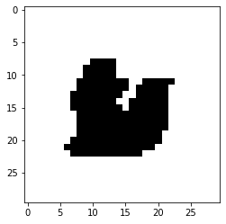
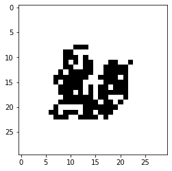

# Genetic Algorithm based image recreation from scratch
Another GA based code. Here I take the image itself as a chromosome and do basic boolean algebra operation on them. For crossover I used,
 - OR
 - NOR
 - XOR
 - XNOR
 - AND
 - Discrete Recombination

on random selected images. Operation is selected through random process too. For mutation I randomly invert given amount of pixels in the image.

## Results
 - Population size - 100
 - Intermediate population size = 200
 - zero percentage of a starting images = 10%
 - mutation percentage = 15% (85% - crossover)
 - No of generations = 100000

Invite you guys to make this better than this. 
